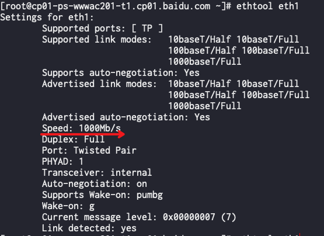

# shell

[TOC]
## 小技巧

### 远程执行脚本
``` bash
pl mac 'bash -c "$(wget -q -O - 10.195.65.39:/tmp/do.sh)"'
```
### 设置shell版本
``` bash
chsh -s /bin/zsh
```
### demsg显示时间

```bash
dmesg_with_human_timestamps () {
    $(type -P dmesg) "$@" | perl -w -e 'use strict;
        my ($uptime) = do { local @ARGV="/proc/uptime";<>}; ($uptime) = ($uptime =~ /^(\d+)\./);
        foreach my $line (<>) {
            printf( ($line=~/^\[\s*(\d+)\.\d+\](.+)/) ? ( "[%s]%s\n", scalar localtime(time - $uptime + $1), $2 ) : $line )
        }'
}
```


## 工具

### sed
#### 在文件行末追加字段

```bash
sed 's/$/ '$hostname'/' hehe.file #hostname 为要替换的变量
```
#### 删除指定行

```bash
sed '1,4d' hehe.file #删除1~4行
sed '4d' hehe.file #删除第4行
sed -e '1d' -e '3d' hehe.file #删除第1行和第4行
```

#### 指定行追加文件内容

```bash 
sed -i '/10.175.149.111*$/r aa' frequency.conf # aa为要追加的文件
```

#### 匹配行后添加内容

```bash
sed -i '/proxy_set_header X-Logid*/a\proxy_set_header X-Vip $vip;' nginx.conf # 匹配行后加
sed -i '/proxy_set_header X-Logid*/i\proxy_set_header X-Vip $vip;' nginx.conf # 匹配行前加
```
#### 获取指定行
```bash
sed -n '1000, 10000'p aa.txt
```
### seq

控制位数
```bash
seq -f "%02g" 1 3
```
>01
02
03

### awk

#### awk之match函数

功能：match函数是用于个性化定制搜索模式。

例子：

   文件内容：

this is wang ,not wan

that is chen, not che 

this is chen ,and wang ,not wan che 

  思路：

比如你想提取is后面的第一个单词，和not 后面的第一个单词，

这时候利用位置来提取是不可行的，因为第三行的模式和前两行不一致，这种情况在基因注解里经常会碰到。

这是就可以用awk的match函数啦！！

```bash
[wangjq@mgmt humandb]$ cat test
this is wang,not wan
that is chen,not che
this is chen,and wang,not wan che
[wangjq@mgmt humandb]$ awk '{match($0,/.+is([^,]+).+not(.+)/,a);print a[1],a[2]}' test
 wang  wan
 chen  che
 chen  wan che
```

格式：match(string,regexp,array)  和string~regexp的作用类似

没有array的情况下：通过regexp，在string中寻找最左边，最长的substring，返回substring的index位置。

有array的情况下：在regexp中用()将要组成的array的内容按顺序弄好,a[1]代表第一个（）的内容，a[2]代表第二个（）的内容，以此类推。
```bash
echo "gene_type  "mrna";gene_name "typ""|awk 'match($0,/(gene_type).+(".+?");gene_name/,a){print a[1]}'
gene_type
 
echo "gene_type  "mrna";gene_name "typ""|awk 'match($0,/(gene_type).+("+?");gene_nae/,a){print a[2]}'
mrna
```

#### awk之拼接字符串

```bash
cat /home/work/search/basa_ac/log/log.bak/search_ac.log.2019030${day}*|grep -oP '^SEARCH_NOTICE: \d+-\d+ \d+:\d+:\d+: |pre2=.*? |qtck\d+_2=.*? '|awk '/^SEARCH_NOTICE/{if (n++) print " "}{printf $0}'
```
会把以SEARCH_NOTICE 开头的行合并，相当之好用

#### awk 合并奇数行与偶数行

``` shell
awk '{if(NR%2 == 1){machine=$NF}else{print machine, $1}}' file
```

#### 去掉行末的回车

```bash
cat aa|awk '{printf $0" "}'
# 结果 bd bj bjfsg fsh fwh gz gzfsg hb-fsg hkg sin su szfsg yq %
```

### ss 使用

#### ss -m

说下各字段意思

 mem:(r0,w0,f0,t0)

 [参见](http://man7.org/linux/man-pages/man7/sock_diag.7.html)

 r:SK_MEMINFO_RMEM_ALLOC

    The amount of data in receive queue
 w:SK_MEMINFO_WMEM_QUEUED

    The amount of data queued by TCP, but not yet sent.
 f:SK_MEMINFO_FWD_ALLOC

    The amount of memory scheduled for future use (TCP only).
 t:SK_MEMINFO_WMEM_ALLOC

    The amount of data in send queue.

## git
### 切换分支
挑选分支
```bash
git branch -a
```
切换分支
```bash
git checkout -b 分支名
```
查看当前分支
```bash
git branch
```
### 切至某一次提交
```bash
git reset a76593d0ea4a0afb6e3831332fe87c6a4e73d5b5
git reset a76593d0ea4a0afb6e3831332fe87c6a4e73d5b5 --hard
```
### 打patch
```bash
git diff >patch #生成patch
git apply --check patch #检测patch能否打上
git apply patch #打patch
git diff --staged #diff 已经被add的文件
```
### 查看仓库地址
```bash
git remote -v
```
### git commit 后修改注释
```
git commit --amend
```
### git diff 已经commit的代码
```bash
git diff --staged
```
### 把自己的改动置于顶端
```bash
git pull --rebase
```


## Shell中的${}、##和%%使用范例
```
file=/dir1/dir2/dir3/my.file.txt
可以用${ }分别替换得到不同的值：
${file#*/}：删掉第一个 / 及其左边的字符串：dir1/dir2/dir3/my.file.txt
${file##*/}：删掉最后一个 / 及其左边的字符串：my.file.txt
${file#*.}：删掉第一个 . 及其左边的字符串：file.txt
${file##*.}：删掉最后一个 . 及其左边的字符串：txt
${file%/*}：删掉最后一个 / 及其右边的字符串：/dir1/dir2/dir3
${file%%/*}：删掉第一个 / 及其右边的字符串：(空值)
${file%.*}：删掉最后一个 . 及其右边的字符串：/dir1/dir2/dir3/my.file
${file%%.*}：删掉第一个 . 及其右边的字符串：/dir1/dir2/dir3/my
记忆的方法为：
#是 去掉左边（键盘上#在 $ 的左边）
%是去掉右边（键盘上% 在$ 的右边）
单一符号是最小匹配；两个符号是最大匹配
${file:0:5}：提取最左边的 5 个字节：/dir1
${file:5:5}：提取第 5 个字节右边的连续5个字节：/dir2
也可以对变量值里的字符串作替换：
${file/dir/path}：将第一个dir 替换为path：/path1/dir2/dir3/my.file.txt
${file//dir/path}：将全部dir 替换为 path：/path1/path2/path3/my.file.txt
```
## fio磁盘性能测试工具
```bash
fio -name iops -rw=write -bs=300kb -runtime=300 -filename ./test.log --allow_mounted_write=1 --direct=1 --size=10240000
```
效果如下：

SSD:


SATA:


## 查看网卡多队列

```bash
cat /proc/interrupts | grep eth0
```

## ethtool

### 查看网卡带宽

```bash
/usr/local/sbin/ethtool eth1
```


## ulimit

有时候，手工执行ulimit -c unlimited 会失败

>  -bash: ulimit: core file size: cannot modify limit: Operation not permitted

问题原因是用户没有ulimit的权限

> vi /etc/security/limits.conf

添加以下信息

```bash
* hard core unlimited
* soft core unlimited
```

/sbin/sysctl -p 使立即生效

## su 至指定账户并执行命令

```bash
sudo su work -c "meta-query relation service $host -f path|grep -vP 'path'"
```

## dd 创建指定大小文件

```bash
dd if=/dev/zero of=sun.txt bs=1M count=1
```

## 文件操作

### 把两个文件按行合并

``` bash
paste file1 file2
```

## 获取占用fd最大的前20个进程

```bash
for x in `ps -eF| awk '{ print $2 }'`;do echo `ls /proc/$x/fd 2> /dev/null | wc -l` $x `cat /proc/$x/cmdline 2> /dev/null`;done | sort -n -r | head -n 20
```

## 校验端口通不通

```shell
nc -w 1 - v 150.138.249.231 443
```

## wiki添加阅读量统计

```markdown
<script async src="//busuanzi.ibruce.info/busuanzi/2.3/busuanzi.pure.mini.js"></script> <span id="busuanzi_container_page_pv" style="font-size:1.2em;color:grey;background-color:lightyellow">本文总阅读量 <span id="busuanzi_value_page_pv" style="color:green"></span> 次</span></p>
```